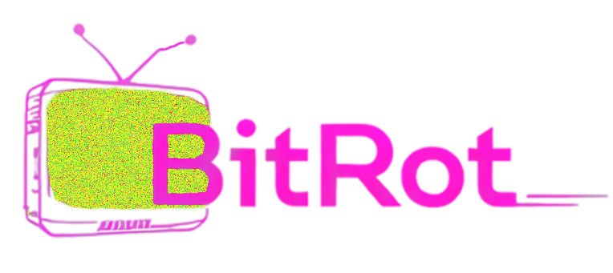

# BitRot



**BitRot** is a video effects application that lets you add authentic retro CRT, VHS, and analog circuit bending effects to your videos. Perfect for creating nostalgic aesthetics, music videos, or adding character to modern footage.

**Currently in Beta (v0.1)**

## Features

- **CRT TV Effect**: Recreate the look of old CRT televisions with scanlines, RGB masks, barrel distortion, and more
- **VHS Glitch**: Simulate worn VHS tapes with tracking errors, color bleeding, and head switching artifacts
- **Analog Circuit**: Create experimental video effects reminiscent of circuit-bent video equipment
- **Real-time Preview**: See your effects as you adjust parameters
- **Customizable Parameters**: Fine-tune each effect with detailed controls
- **High-Quality Export**: Save your processed videos in various quality levels

## Installation

### Option 1: Windows Executable (Easiest)

1. Download the latest release from the [Releases page](https://github.com/yourusername/bitrot/releases)
2. Extract the ZIP file
3. Run `BitRot.exe`

### Option 2: From Source

1. Clone this repository:
   ```
   git clone https://github.com/yourusername/bitrot.git
   cd bitrot
   ```

2. Install the required dependencies:
   ```
   pip install -r requirements.txt
   ```

3. Run the application:
   ```
   python main.py
   ```

## Requirements

If running from source, you'll need:

- Python 3.7+
- PyQt5
- OpenCV (opencv-python)
- NumPy

## Usage

1. Click "Load Video" to select your source video
2. Choose an effect from the dropdown menu (CRT TV, VHS Glitch, or Analog Circuit)
3. Adjust the effect parameters using the sliders in the right panel
4. Use the Preview Quality dropdown to adjust performance vs. quality during preview
5. When satisfied with your effect, click "Save" to export the processed video

## Current Status

BitRot is currently in **Beta (v0.1)**. While the application is functional, you may encounter bugs or performance issues. We're actively working on improvements!

### Known Limitations:

- Processing very large videos may be slow or cause memory issues
- Some effect combinations may produce unexpected results
- Limited input format support

## Contributing

We welcome contributions to BitRot! If you'd like to get involved:

1. **Report bugs or suggest features** by opening an [issue](https://github.com/yourusername/bitrot/issues)
2. **Submit pull requests** for bug fixes or new features
3. **Share examples** of videos created with BitRot

If you're planning significant changes, please open an issue first to discuss your ideas.

## Planned Improvements

- Additional effect types
- Keyframing support for animating effect parameters
- Improved performance for preview and rendering
- Batch processing capabilities
- Support for more input/output formats
- UI improvements and themes

## License

[MIT License](LICENSE) - Feel free to use, modify, and distribute this software.

---

*BitRot: Authentic digital decay for the modern age.* 